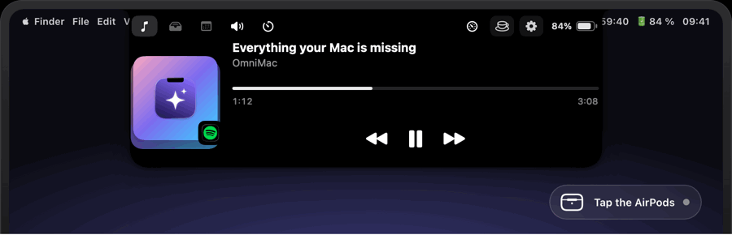
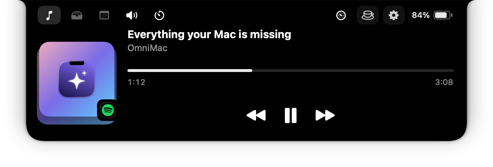
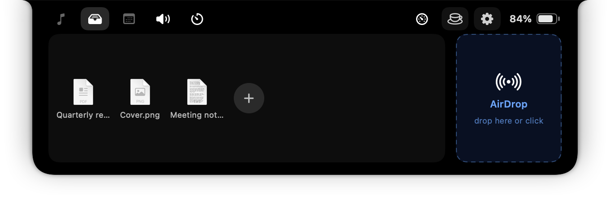
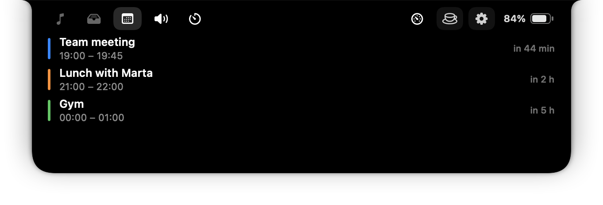
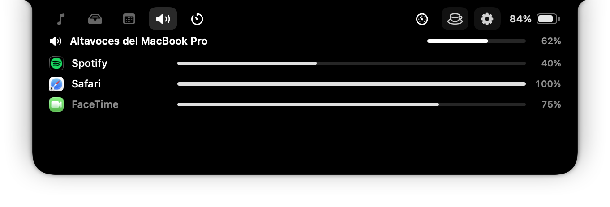
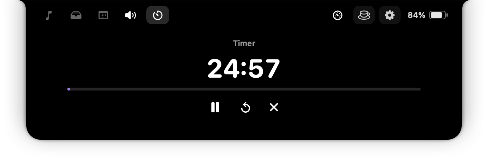
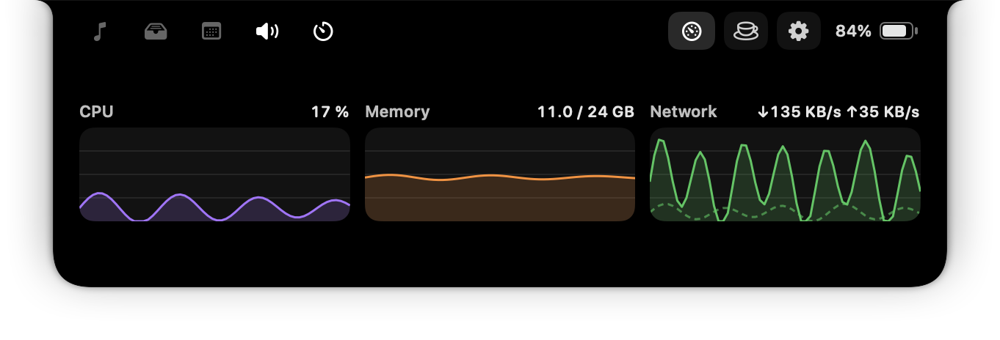

<p align="center">
  
</p>

<h1 align="center">OmniMac</h1>

<p align="center">
  <b>Everything your Mac is missing.</b><br>
  Seven utilities in one menu-bar app: lightweight, free and open source.
</p>

<p align="center">
  <a href="README.md">🇪🇸 Español</a> · <b>🇬🇧 English</b>
</p>

<p align="center">
  <a href="https://github.com/BySergiMM/OmniMac/releases/latest"></a>
  <a href="https://github.com/BySergiMM/OmniMac/releases"></a>
  <a href="https://github.com/BySergiMM/OmniMac/actions/workflows/build.yml"></a>
  
  
  <a href="LICENSE"></a>
</p>

<p align="center">
  <a href="https://github.com/BySergiMM/OmniMac/releases/latest/download/OmniMac.pkg"></a>
  &nbsp;
  <a href="https://bysergimm.github.io/OmniMac/en/"></a>
  &nbsp;
  <a href="https://ko-fi.com/seergiii"></a>
</p>

<p align="center">
  
</p>

<p align="center">
  
</p>

<p align="center"><sub>Real captures, generated by the app itself (<code>OmniMac --snapshots</code>).</sub></p>

<table align="center">
  <tr>
    <td align="center"><br><sub>Tray and AirDrop</sub></td>
    <td align="center"><br><sub>Calendar</sub></td>
  </tr>
  <tr>
    <td align="center"><br><sub>Sound and per-app volume</sub></td>
    <td align="center"><br><sub>Timer and Pomodoro</sub></td>
  </tr>
  <tr>
    <td align="center"><br><sub>Performance</sub></td>
    <td align="center"><br><sub>When your AirPods or Beats connect</sub></td>
  </tr>
</table>

## In two lines

Keep-awake, ⌘Tab by windows, a dynamic notch, window shortcuts and layouts, clipboard
history, tools (OCR, colour picker, mic mute…) and sound with per-app volume. It uses
**0.017 % CPU and 50 MB of real memory at idle**: 81 % less than the five apps it replaces
([study](docs/PERFORMANCE.md), in Spanish; 0.4.1 measurement: 0.017 % CPU, 19–27 MB of real memory and 0.7 wake-ups/s at idle, 2.1 % with the notch open and music playing). No accounts, no telemetry; it updates itself.
The interface follows your Mac's language (English or Spanish) and can be forced in Settings.

**Install**: download [`OmniMac.pkg`](https://github.com/BySergiMM/OmniMac/releases/latest/download/OmniMac.pkg)
and open it, or `brew install --cask BySergiMM/tap/omnimac`. OmniMac isn't signed with an
Apple developer account, so the first time macOS will warn: System Settings › Privacy &
Security › "Open Anyway".

## Modules

| Module | What it does |
|---|---|
| ☕ **Keep awake** | Like Amphetamine: indefinitely, with a timer or until a given time. Stays awake with the lid closed (one admin password, ever), stops on low battery, turns on with the charger or an external display. Time left in the menu bar. |
| ⌘ **⌘Tab by windows** | Switch between windows, not apps, with live thumbnails. Type to search; ⌘W / ⌘M / ⌘H / ⌘Q act on the selected window; ⌥Tab optional. |
| ▮ **Dynamic notch** | Hover the notch and it expands: music (Spotify / Music), a file tray with AirDrop, today's calendar, sound with per-app volume, timer and Pomodoro, performance charts. Sneak peek on track change, notices, battery, an iPhone-style card when AirPods or Beats connect. Hides in full screen; works as an island on Macs without a notch. |
| ▭ **Window shortcuts** | 21 shortcuts (halves, quarters, thirds, almost-maximize, larger/smaller, restore, next display), snap by dragging to edges with a footprint, size cycling, and saved layouts on ⌃⌥1…9 (⌃⌥0 undoes). |
| 📋 **Clipboard history** | Text, images and files; search, pins (⌥P), pause, optional persistence to disk. ⇧⌘V to paste. |
| 🛠 **Tools** | Copy text from the screen (OCR, ⇧⌘2), copy a colour (⇧⌘6), mute the mic (⌃⌥⌘M), lock the keyboard to clean it (⌃⌥⌘L), hide desktop icons, hold-to-quit guard for ⌘Q. |
| 🔊 **Sound** | Output/input devices, volume, balance, mute, a different volume for every app, ⌃⌥⌘O cycles the output. Follows the volume keys in real time. |

Every module can be switched off; switched-off modules disappear from the menu and the notch.

## Requirements and permissions

macOS 14.2 (Sonoma) or later, Apple silicon or Intel. Permissions are requested only when a
feature needs them: Accessibility (window management, ⌘Tab), Screen Recording (thumbnails,
OCR), Calendar (notch tab), system-audio capture (per-app volume).

## Build from source

```bash
./build.sh run        # builds a universal binary and launches dist/OmniMac.app
./build.sh pkg        # .pkg installer (also sets up closed-lid mode)
swift test            # unit tests (needs Xcode)
```

Snapshots for the website: `dist/OmniMac.app/Contents/MacOS/OmniMac --snapshots <dir> [--lang en]`.
Releases: `scripts/release.sh <version> --publish` (Sparkle appcast, GitHub release, Homebrew tap).

Development helpers live in `scripts/dev`: `quickbuild.sh` (Apple silicon-only rebuild into `dist/`
in seconds), `measure.sh` (60 s idle CPU/memory), `wakeups.sh` (idle wake-ups before and after
opening the notch three times), plus `mouse.swift`, `notch.swift` and `settings.swift` to drive the
app from the terminal. When measuring, remember that `top -l`'s `IDLEW`/`CSW` columns are cumulative
counters, not rates, and that Accessibility queries cost the queried app CPU.

## Architecture

`Sources/OmniMac/App` (app lifecycle), `Support` (shared helpers: Accessibility, hotkeys,
permissions, notifications, toasts, localization), `UI` (SwiftUI settings), and one folder
per module under `Features`. Rules of the house: a module is a `BaseFeature` subclass with
`start()`/`stop()`; nothing runs at idle; shared code lives in `Support`. Full Spanish
documentation in [README.md](README.md).

## License

MIT. If OmniMac saves you time every day, you can [buy me a coffee](https://ko-fi.com/seergiii)
or support the project on [GitHub Sponsors](https://github.com/sponsors/BySergiMM).
