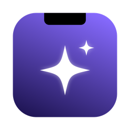
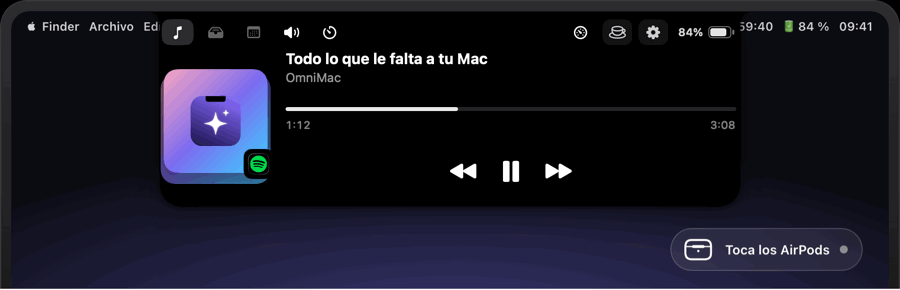
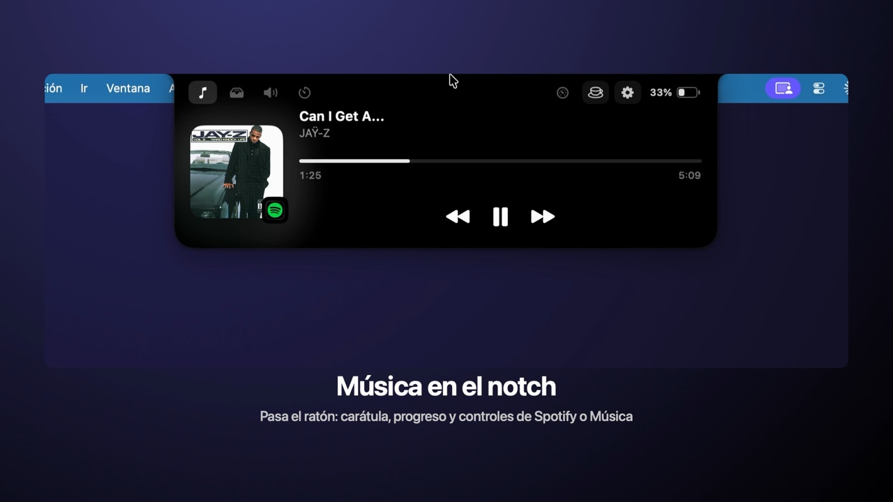
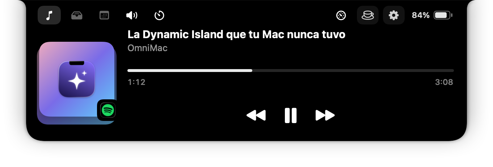
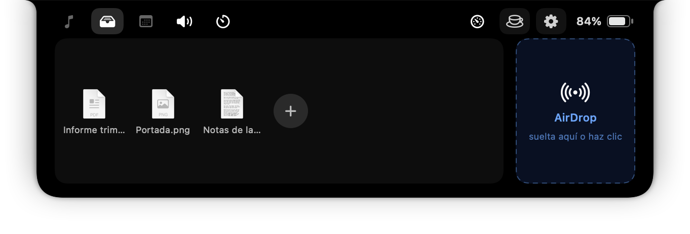
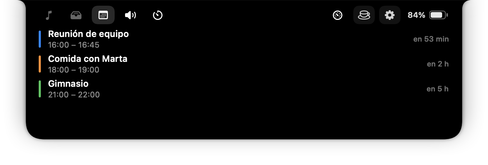
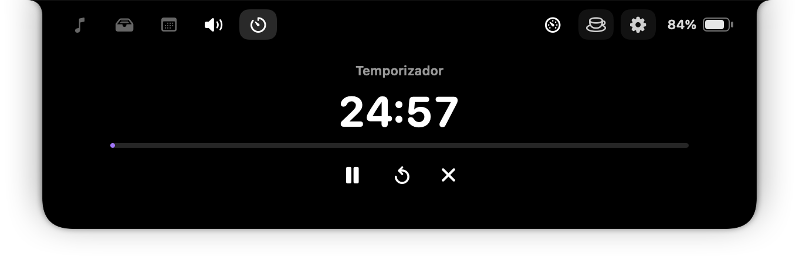
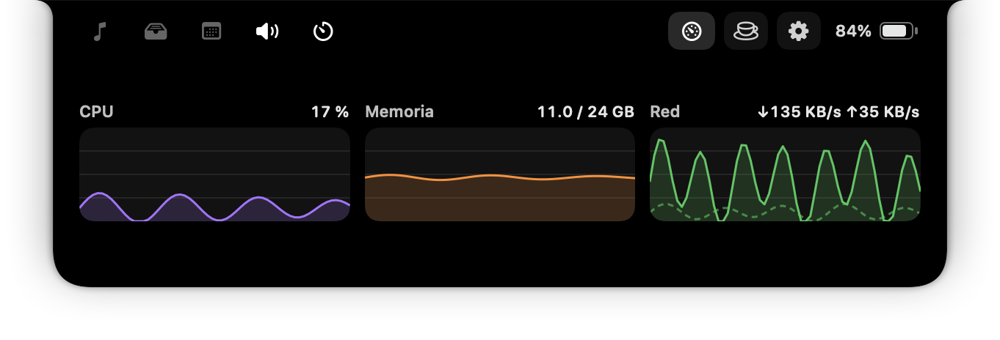

<p align="center">
  
</p>

<h1 align="center">OmniMac</h1>

<p align="center">
  <b>Todo lo que le falta a tu Mac.</b><br>
  Siete utilidades en una sola app de barra de menús: ligera, gratis y de código abierto.
</p>

<p align="center">
  <b>🇪🇸 Español</b> · <a href="README.en.md">🇬🇧 English</a>
</p>

<p align="center">
  <a href="https://github.com/BySergiMM/OmniMac/releases/latest"></a>
  <a href="https://github.com/BySergiMM/OmniMac/releases"></a>
  <a href="https://github.com/BySergiMM/OmniMac/actions/workflows/build.yml"></a>
  
  
  <a href="LICENSE"></a>
</p>

<p align="center">
  <a href="https://github.com/BySergiMM/OmniMac/releases/latest/download/OmniMac.pkg"></a>
  &nbsp;
  <a href="https://bysergimm.github.io/OmniMac/"></a>
  &nbsp;
  <a href="https://ko-fi.com/seergiii"></a>
</p>

<p align="center">
  
</p>

<p align="center">
  <a href="https://github.com/BySergiMM/OmniMac/releases/download/media/omnimac-tour-16x9-es.mp4"></a><br>
  <sub>▶ <a href="https://github.com/BySergiMM/OmniMac/releases/download/media/omnimac-tour-16x9-es.mp4">Vídeo del recorrido completo (106 s)</a> · <a href="https://github.com/BySergiMM/OmniMac/releases/download/media/omnimac-tour-vertical-es.mp4">vertical</a> · <a href="https://github.com/BySergiMM/OmniMac/releases/tag/media">todos los vídeos, también en inglés</a></sub>
</p>

<p align="center">
  
</p>

<p align="center"><sub>Capturas reales, generadas por la propia app (<code>OmniMac --snapshots</code>).</sub></p>

<table align="center">
  <tr>
    <td align="center"><br><sub>Bandeja y AirDrop</sub></td>
    <td align="center"><br><sub>Calendario</sub></td>
  </tr>
  <tr>
    <td align="center"><br><sub>Sonido y volumen por app</sub></td>
    <td align="center"><br><sub>Temporizador y Pomodoro</sub></td>
  </tr>
  <tr>
    <td align="center"><br><sub>Rendimiento</sub></td>
    <td align="center"><br><sub>Al conectar tus AirPods o Beats</sub></td>
  </tr>
</table>

## En dos líneas

Mantener despierto, ⌘Tab por ventanas, notch dinámico, atajos y disposiciones de
ventanas, historial del portapapeles, utilidades (OCR, color, micrófono…) y sonido con
volumen por app. Consume **0,017 % de CPU y 50 MB de memoria real en reposo**: un 81 %
menos que las cinco apps a las que sustituye ([estudio](docs/PERFORMANCE.md)). Sin cuentas,
sin telemetría; se actualiza sola. La interfaz sigue el idioma del Mac (español o inglés) y se puede fijar en Ajustes.

**Instalar**: descarga [`OmniMac.pkg`](https://github.com/BySergiMM/OmniMac/releases/latest/download/OmniMac.pkg)
y ábrelo, o `brew install --cask BySergiMM/tap/omnimac`. Como no está firmada con una cuenta de desarrollador de Apple, la primera vez
macOS avisará: Ajustes del Sistema › Privacidad y seguridad › «Abrir igualmente».

## Módulos

| Módulo | Qué hace | Inspirado en |
|---|---|---|
| ☕️ **Mantener despierto** | Evita que el Mac se duerma: sin límite, con temporizador (15 min – 8 h) o **hasta una hora concreta**. Tiempo restante en la barra de menús, aviso al terminar, parada automática si la batería baja del umbral, **disparadores** (mientras esté enchufado o haya pantalla externa), opción de dejar apagar la pantalla y **modo tapa cerrada** (la música sigue al cerrar el MacBook). | Amphetamine |
| 🪟 **⌘Tab por ventanas** | Al pulsar ⌘Tab (o ⌥Tab, si lo activas) ves **todas las ventanas**, no solo las apps, con miniaturas en vivo. **Escribe para buscar**; ⌘W cierra, ⌘M minimiza, ⌘H oculta y ⌘Q sale de la app elegida. Suelta ⌘ para cambiar. | AltTab (incluido lo de pago) |
| ✨ **Notch dinámico** | Pasa el ratón por el notch y se expande con sus pestañas: **Música** (Spotify/Música: carátula, progreso y controles), **Bandeja** (archivos y **zona AirDrop**), **Calendario** (los eventos de hoy), **Sonido**, **Temporizador** (cuenta atrás y Pomodoro con tiempos configurables, con el tiempo restante junto al icono de la barra) y **Rendimiento**. Arriba, siempre: **batería con %**, «mantener despierto» y Ajustes. **Vistazo rápido** al cambiar de canción; se **oculta en apps a pantalla completa**. Cada pestaña se puede activar o desactivar en Ajustes. | BoringNotch |
| 🧲 **Atajos de ventanas** | Mitades (repetir cicla ½ → ⅔ → ⅓), cuartos, **tercios**, maximizar, casi maximizar, centrar, más grande/pequeño, restaurar y pasar a otra pantalla con ⌃⌥ + teclas. **Arrastra una ventana a un borde o esquina** para ajustarla (con huella previa). Y **disposiciones**, como los presets de una radio: ⌃⌥1…9 guarda la actual en un número libre o aplica la que ya tenga (mantener pulsado libera el número), ⌃⌥0 deshace, y pueden aplicarse solas al conectar el monitor. | Rectangle / Moom |
| 📋 **Historial del portapapeles** | Guarda **texto, imágenes y archivos**; ⇧⌘V abre el historial, **escribe para buscar**, **⌥P ancla** lo que uses siempre y pega el elemento elegido donde estabas. Pausa cuando quieras y, si lo activas, se conserva en disco. | Maccy |
| 🛠️ **Utilidades** | **Copiar texto de la pantalla** (⇧⌘2, OCR), **copiar un color** (⇧⌘6: clic en un punto y su hex va al portapapeles), **silenciar el micrófono** (⌃⌥⌘M), **bloquear el teclado 30 s para limpiarlo** (⌃⌥⌘L), **ocultar los iconos del escritorio** y **evitar el ⌘Q accidental** (solo cierra si mantienes ⌘Q medio segundo). | TextSniper, Pika, Mic Drop, KeyboardCleanTool, HiddenMe, CommandQ |
| 🔊 **Sonido** | **Volumen distinto para cada app** (Spotify al 40 %, el navegador al 100 %…), desde el notch o Ajustes; el volumen del Mac se sigue en tiempo real (teclas incluidas). Cambia de **salida** y de **micrófono** al instante, con **volumen, balance y silencio** por dispositivo, y **⌃⌥⌘O** para ciclar la salida. | SoundSource / Background Music |
| 📈 **Rendimiento** | Tres gráficos del último minuto (CPU, memoria y red) en el notch y en Ajustes. Solo mide mientras se ven. | iStat Menus (versión mínima) |

## Instalar (recomendado): el instalador `.pkg`

Requisitos: macOS 14.2+ y las Command Line Tools de Xcode (`xcode-select --install`).

```bash
./build.sh pkg
```

Genera `dist/OmniMac-<versión>.pkg`. Al abrirlo, macOS pide la contraseña de
administrador **una sola vez** y el instalador deja la app en `/Applications` y
la regla del modo *tapa cerrada* (ver Permisos): a partir de ahí la app nunca
vuelve a pedir contraseña. Al terminar, OmniMac se abre en la barra de menús.

**Actualizaciones**: la app busca versiones nuevas una vez al día (Sparkle) en las
releases de GitHub y te avisa; también desde el menú («Buscar actualizaciones…») o
Ajustes › Inicio. Para publicar una versión: `scripts/release.sh 0.3.0 --publish`
(compila, empaqueta, firma con la clave del llavero, genera el appcast y crea la
release con `gh`). Hace falta que el repositorio exista en GitHub
(`gh repo create BySergiMM/OmniMac --public --source=. --push`).

Para desinstalarla del todo (app, regla, preferencias y permisos):

```bash
scripts/uninstall.sh
```

## Ajustes

La ventana de Ajustes sigue el estilo de Ajustes del Sistema: una página por módulo
en la barra lateral (con su interruptor general arriba) y formularios agrupados con
una explicación corta bajo cada opción. Todo lo configurable está ahí: apertura y
contenido del notch, temporizador y Pomodoro, avisos, disposiciones de ventanas,
portapapeles, utilidades, sonido y actualizaciones.

## Compilar y ejecutar (desarrollo)

```bash
./build.sh run
```

Esto compila con Swift Package Manager, genera `dist/OmniMac.app` (con su icono,
que se crea una vez con `scripts/make-icon.swift`), cierra la instancia que
hubiera abierta y la abre. Sin `run` solo compila. La app vive en la barra de
menús, no aparece en el Dock. Si no se instaló con el `.pkg`, el modo tapa
cerrada pide la contraseña la primera vez que activas el café (también una vez).

La primera vez se abre la ventana de Ajustes y se pide el permiso de Accesibilidad.

## Permisos

- **Accesibilidad**: necesario para el selector ⌘Tab, mover ventanas y el pegado
  automático del portapapeles. Sin él, esos módulos esperan y la app te lo avisa.
- **Automatización**: macOS lo pedirá la primera vez que el notch controle
  Música o Spotify.
- **Calendario**: solo si abres la pestaña Calendario del notch.
- **Grabación de pantalla**: miniaturas en vivo de ⌘Tab y «copiar texto de la pantalla».
- **Audio del sistema**: solo si pones a alguna app un volumen distinto del 100 %
  (OmniMac capta el audio de esa app para reproducirlo al nivel elegido; las demás no
  se tocan y, si OmniMac se cierra, todo vuelve a la normalidad).
- **Administrador (solo una vez)**: el modo *tapa cerrada* de «Mantener
  despierto» usa `pmset -a disablesleep`, el único ajuste que evita el reposo al
  cerrar la tapa. La primera vez que actives el café con ese modo, macOS pedirá
  tu contraseña e instalará `/etc/sudoers.d/omnimac-lid`, una regla que permite
  a tu usuario ejecutar **solo** `pmset -a disablesleep 1` y `… 0` sin
  contraseña. Después nunca vuelve a pedirla; OmniMac restaura el ajuste al
  desactivar el café, al salir y al arrancar. Para deshacerlo:
  `sudo rm /etc/sudoers.d/omnimac-lid`.

> ℹ️ La app se firma *ad-hoc* al compilar, pero con un **requisito designado
> estable** (`identifier "com.seergiii.omnimac"`), así que el permiso de
> Accesibilidad se ancla al identificador de la app y **no se revoca al
> recompilar**: lo concedes una sola vez. (Si vienes de una versión anterior,
> quita la entrada vieja de OmniMac en la lista de Accesibilidad y vuelve a
> añadirla una vez.)

## Atajos

| Atajo | Acción |
|---|---|
| ⌘ Tab / ⌘⇧ Tab | Selector de ventanas (adelante / atrás) |
| ⌘ + flechas | Moverse por la cuadrícula del selector |
| Escribir (selector abierto) | Buscar por título de ventana o app |
| ⌘ W / ⌘ M / ⌘ H / ⌘ Q (selector abierto) | Cerrar / minimizar la ventana elegida; ocultar / cerrar su app |
| ⇧⌘ V | Historial del portapapeles (escribe para buscar, ⌥⌫ borra) |
| ⌃⌥ ← / → | Mitad izquierda / derecha |
| ⌃⌥⇧ ↑ / ↓ | Mitad superior / inferior |
| ⌃⌥ ↑ / ↩ / ↓ | Maximizar / casi maximizar / centrar |
| ⌃⌥ U / I / J / K | Cuartos de pantalla |
| ⌃⌥ D / F / G | Tercios: primero, central, último |
| ⌃⌥ E / T | Dos tercios: primeros, últimos |
| ⌃⌥ = / − | Más grande / más pequeño |
| ⌃⌥ ⌫ | Restaurar el tamaño anterior |
| ⌃⌥⌘ → / ← | Pantalla siguiente / anterior |
| ⇧⌘ 2 | Copiar texto de la pantalla (OCR) |
| ⌃⌥⌘ M | Silenciar / activar el micrófono |
| ⌃⌥⌘ L | Bloquear el teclado 30 s |
| ⌃⌥⌘ O | Siguiente salida de audio |
| ⇧⌘ 6 | Copiar el color de un punto de la pantalla |
| ⌃⌥ 1 … 9 | Disposiciones: número libre → guarda la actual; ocupado → la aplica; mantenido → libera el número |
| ⌃⌥ 0 | Deshacer la última disposición aplicada |
| ⌘ Q (mantenido ½ s) | Cerrar la app; un toque rápido no hace nada |

## El notch, en detalle

- **Pestaña Música**: carátula (Spotify) que se ilumina al reproducir, título,
  artista, barra de progreso arrastrable con tiempos y controles ⏮ ⏯ ⏭. Sin APIs
  privadas: AppleScript.
- **Apertura**: 0,5 s con el ratón encima, una vibración del trackpad (intensidad
  a elegir) y la animación crece desde el centro del notch (nada asoma fuera del negro).
- **Vistazo rápido**: al cambiar de canción, título y artista aparecen bajo el notch
  unos segundos. Y con una app a pantalla completa delante, el notch se esconde.
- **Capas**: el panel va por encima de la barra de menús y de sus iconos, y plegado
  mide exactamente lo que el notch físico (nada se ve al cambiar de escritorio).
- **Avisos**: los avisos breves («Texto copiado», «Micrófono silenciado»…) salen como
  pastilla abajo o, si lo prefieres, desplegando el notch (Ajustes › Notch › Avisos).
- **Todo a la carta**: en Ajustes › Notch dinámico › «Pestañas» y «Botones de la cabecera» apagas
  cualquier pestaña (Música, Bandeja, Calendario, Sonido, Temporizador, Rendimiento)
  y cualquier botón de la cabecera (café, Ajustes, batería); su icono desaparece al
  momento.
- **Pestañas Sonido y Rendimiento** dentro del notch: volumen por app y salida de
  audio, y los tres gráficos (CPU, memoria, red).
- **Pestaña Bandeja**: suelta archivos para tenerlos a mano (arrástralos luego a
  cualquier sitio, doble clic para abrir) y una **zona AirDrop**: los archivos que
  sueltes ahí se envían directamente. Un **clic** en la bandeja o en AirDrop abre
  el diálogo del Finder para elegir los archivos sin tener que arrastrarlos.
- **Cabecera**: batería con porcentaje (verde cargando, roja < 20 %; **clic** para
  abrir Ajustes del Sistema › Batería), acceso rápido a «Mantener despierto» y a
  los Ajustes de OmniMac.
- Un clic fuera del notch lo pliega. Arrastrar archivos hacia él lo abre en la
  pestaña Bandeja automáticamente.

## AirPods y Beats en el notch

Al conectar unos AirPods (todos los modelos, también Max) o unos Beats, el notch se
despliega un momento con la tarjeta del iPhone: modelo y batería de cada pieza. La
app se entera por CoreAudio (aparece el dispositivo de audio Bluetooth) y completa
modelo y batería con `system_profiler`, así que no pide ningún permiso. En Ajustes ›
Notch › Auriculares se activa o desactiva y hay un botón «Probar».

El aviso de «conectados» de macOS lo dibuja Control Center y no tiene ajuste para
apagarlo; la opción «Ocultar el aviso de macOS» intenta cerrarlo por Accesibilidad
en cuanto aparece (experimental: solo pulsa un botón llamado cerrar/descartar).

## Marca

- **Tagline**: «Todo lo que le falta a tu Mac»
- **Color**: violeta `#6C4DFF` sobre tinta `#1A0F47`
- **Icono**: chispa blanca + notch sobre degradado violeta (`scripts/make-icon.swift`)
- Apoyar el proyecto: botones en Ajustes › Inicio y en el menú («Invítame a un café»),
  con enlaces a Ko-fi y GitHub Sponsors (`Brand.coffeeURL` / `Brand.sponsorsURL`).
- Plan de lanzamiento y monetización: [docs/MARKETING.md](docs/MARKETING.md)
- Estudio de consumo y comparativa con Amphetamine, AltTab, Rectangle, Maccy y BoringNotch: [docs/PERFORMANCE.md](docs/PERFORMANCE.md)
  Última medición (0.4.1, 5 de septiembre de 2026): reposo **0,017 % de CPU, 19–27 MB de memoria real y 0,7 despertares/s**;
  con el notch abierto y música sonando, 2,1 %. Sin crecimiento de memoria tras abrir y cerrar el notch 10 veces.
- Radiografía de la competencia (todas sus funciones frente a OmniMac y qué añadir): [docs/COMPETENCIA.md](docs/COMPETENCIA.md)

## Arquitectura

```
Sources/OmniMac/
├── main.swift                  Punto de entrada (NSApplication)
├── App/                        Ciclo de vida de la app
│   ├── AppDelegate.swift       Arranque, onboarding, actualizaciones
│   ├── Feature.swift           BaseFeature: módulo activable y persistente
│   ├── FeatureManager.swift    Registro de módulos
│   ├── StatusItemController    Menú de la barra de menús
│   ├── SettingsWindowController   Ventana de Ajustes
│   ├── UpdaterController       Sparkle (actualizaciones automáticas)
│   └── Snapshots.swift         `--snapshots`: capturas reales para la web (y `--lang en`)
├── Support/                    Ayudas compartidas por todos los módulos
│   ├── AX.swift                API de Accesibilidad (leer/colocar ventanas)
│   ├── HotKeyCenter.swift      Atajos globales (Carbon), con pulsar y soltar
│   ├── Permissions.swift       Accesibilidad y grabación de pantalla
│   ├── Notifier.swift          Notificaciones locales
│   ├── Toast.swift             Avisos breves (pastilla abajo o en el notch)
│   ├── FilePicker.swift        Diálogo del Finder para elegir archivos
│   ├── Localization.swift      Idioma: L("es", "en"), el del Mac o el fijado en Ajustes
│   ├── SystemBannerDismisser   Cierra el aviso de AirPods de Control Center (experimental)
│   └── HostingViews.swift      NSHostingView que acepta el primer clic
├── UI/                         Ajustes (SwiftUI): SettingsView, SoundView,
│                               PerformanceView, Brand (colores y textos)
└── Features/                   Un directorio por módulo
    ├── KeepAwake/              IOPMAssertion, modo tapa cerrada, disparadores
    ├── WindowSwitcher/         Event tap ⌘Tab + enumeración AX + panel SwiftUI
    ├── Notch/                  NotchFeature (panel y geometría), NotchView
    │   ├── Tabs/               MediaTab, TrayTab, CalendarTab, SoundTab, PerformanceTab
    │   ├── NotchTimer          Temporizador y Pomodoro
    │   ├── MediaBridge         Spotify / Música (AppleScript + notificaciones)
    │   ├── AirDropPresenter    AirDrop y archivos arrastrados
    │   └── BatteryMonitor, CalendarBridge, NotchHaptics, NotchControls
    ├── Windows/                SnappingFeature (21 atajos), SnapDrag (arrastrar a bordes),
    │                           WindowLayouts (disposiciones ⌃⌥1…9)
    ├── Clipboard/              Historial + panel de pegado
    ├── Tools/                  OCR (Vision), color, micrófono, bloqueo de teclado,
    │                           iconos del escritorio, guardia de ⌘Q
    ├── Sound/                  AudioSystem (CoreAudio), SoundFeature, AppVolumeMixer
    └── Performance/            Muestras de CPU, memoria y red (Mach/getifaddrs)
Tests/OmniMacTests/             Pruebas de la lógica pura (swift test; necesita Xcode)
docs/site/                      Web de presentación (index.html + img/ con capturas reales)
```

Reglas de la casa:

- **Un módulo = una subclase de `BaseFeature`** con `start()`/`stop()`, registrada en
  `FeatureManager` y con su página en `SettingsView`. Persistencia, menú y tarjeta de
  inicio son automáticos. Un módulo apagado **desaparece** del menú y del notch.
- **Nada trabaja en reposo**: sin temporizadores mientras el notch está plegado; batería,
  audio, música y pantallas avisan por notificación. Los gráficos solo muestrean con la
  pestaña abierta. Por eso el consumo en reposo es de 0,017 % de CPU (`docs/PERFORMANCE.md`).
- **Sin código repetido entre módulos**: lo común vive en `Support/` (`AX.setFrame`,
  `Notifier.post`, `Toast.show`, `FilePicker.choose`, `HotKeyCenter.register`).
- **Idioma**: cada texto de la interfaz se escribe una vez en cada idioma, `L("Guardar", "Save")`
  (`Support/Localization.swift`). Sin archivos `.strings`: el texto español queda a la vista en el
  código y es fácil de editar. Los textos de permisos van en `Resources/{es,en}.lproj/InfoPlist.strings`.
- Los cambios de cada versión van en `CHANGELOG.md`. Licencia MIT.

## Herramientas de desarrollo (`scripts/dev`)

Pequeñas utilidades de prueba que usan la API de Accesibilidad, sin permisos de grabación:

```bash
swift scripts/dev/mouse.swift hover|park        # llevar el ratón al notch o apartarlo
swift scripts/dev/notch.swift height|dump|press:Música
swift scripts/dev/settings.swift dump|press:English|near:Mantener despierto|click:Notch
zsh scripts/dev/quickbuild.sh                    # recompila solo Apple silicon y sustituye el binario de dist/ (segundos)
zsh scripts/dev/measure.sh                       # consumo en reposo 60 s (vigila que el notch siga plegado)
zsh scripts/dev/wakeups.sh                       # despertares/s en reposo antes y después de abrir el notch 3 veces
```

Al medir, ojo con dos trampas que ya nos han engañado: las consultas de Accesibilidad a la app
le cuestan CPU a ella (por eso `notch.swift height` usa `CGWindowList`), y las columnas `IDLEW`
y `CSW` de `top -l` son contadores acumulados, no tasas (hay que restar dos muestras).

## Capturas para la web

La propia app renderiza su interfaz a PNG (sin permisos de grabación de pantalla):

```bash
dist/OmniMac.app/Contents/MacOS/OmniMac --snapshots docs/site/img
```

Genera las seis pestañas del notch y el menú real de la barra con datos de muestra.
Con `--notch-width 200 --debug-notch` simula el notch de otro modelo y dibuja en rojo
dónde queda el notch físico, para comprobar que nada se esconde debajo.

## Publicar una versión (actualizaciones automáticas)

Las actualizaciones usan Sparkle con un *appcast* alojado en GitHub Releases. Solo la
primera vez:

```bash
gh repo create BySergiMM/OmniMac --public --source=. --push
```

Después, para cada versión (compila, firma el zip con la clave EdDSA del llavero,
genera `appcast.xml` y crea la release en GitHub):

```bash
scripts/release.sh 0.3.0 --publish
```

Las apps instaladas comprueban una vez al día `SUFeedURL` y ofrecen la nueva versión;
también desde el menú, «Buscar actualizaciones…». El workflow de GitHub Actions
(`.github/workflows/build.yml`) compila y pasa los tests en cada push.

## Limitaciones conocidas (v0.3)

- Compilada como binario universal, pero solo probada en Apple silicon.

- Las miniaturas en vivo del selector ⌘Tab necesitan el permiso de Grabación de
  pantalla; sin él, el selector muestra icono + título.
- La carátula solo aparece con Spotify (Música no expone URL de carátula por AppleScript).
- El historial del portapapeles vive en memoria salvo que actives «Guardar en disco»
  (sin cifrar).
- Los atajos no son personalizables todavía.
- El notch solo controla Spotify y Música (AppleScript); no lee el «Ahora suena» de
  otras apps.
